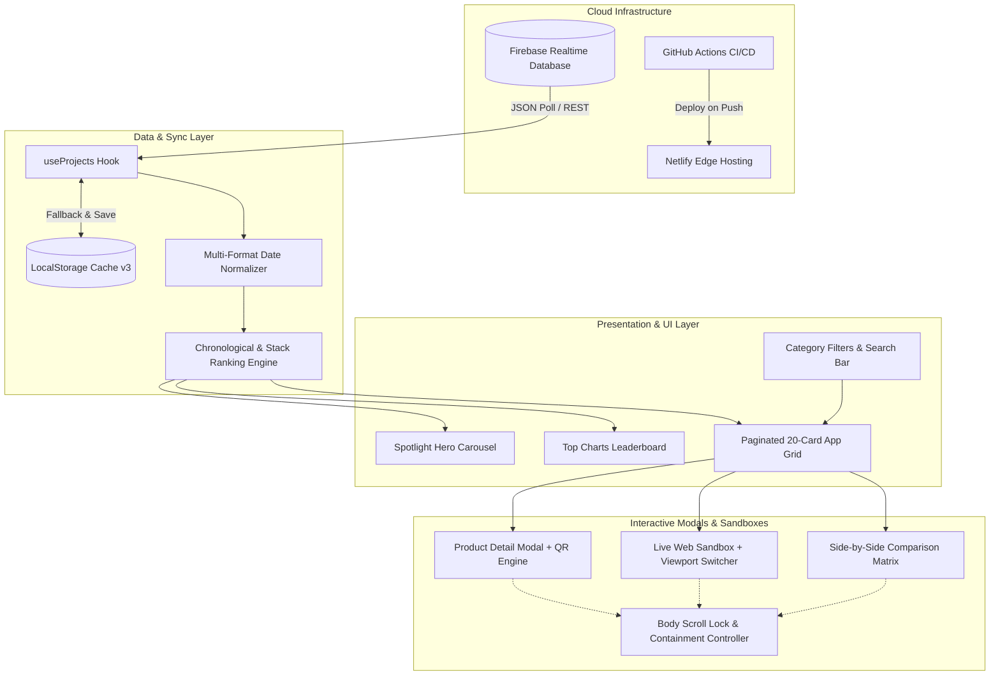
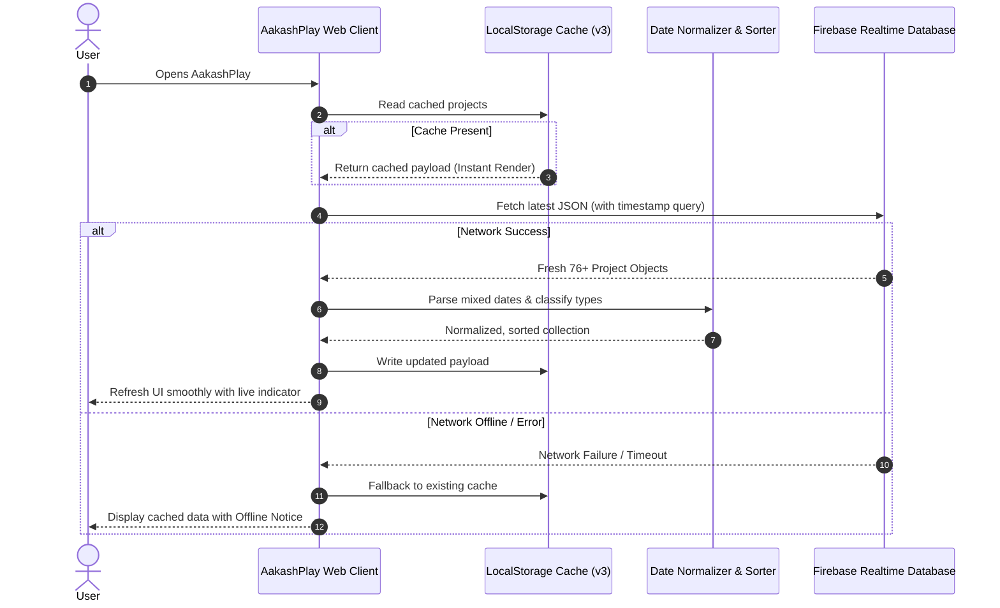
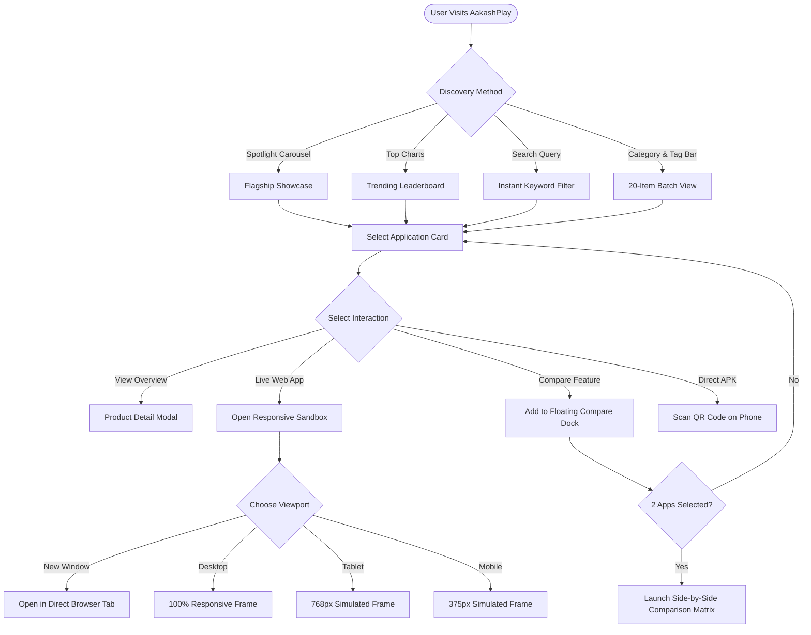
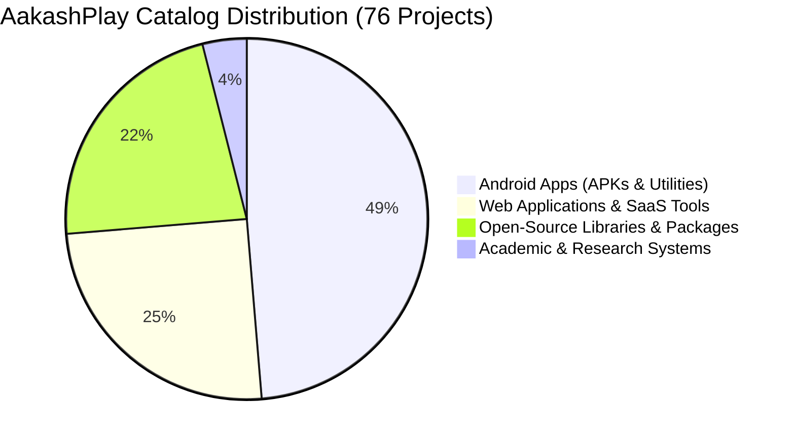
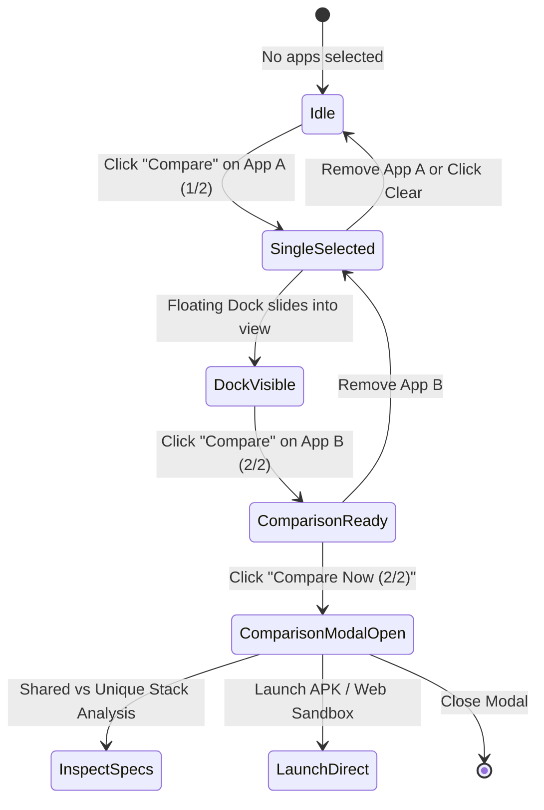
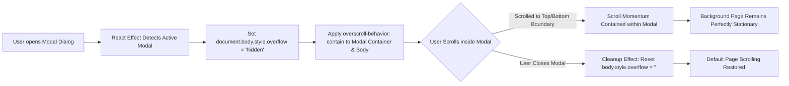

# 🌌 AakashPlay — Official App & Software Storefront

[](https://react.dev/)
[](https://vitejs.dev/)
[](https://firebase.google.com/)
[](https://AakashPlay.netlify.app)
[](LICENSE)

A flagship web platform inspired by the **Google Play Store & Apple App Store**, engineered with a **3D Clay UI (Claymorphism)** in a **Cosmic Purple & Neon Violet** aesthetic. AakashPlay is powered live by **Google Firebase Realtime Database**, delivering instant access to **76+ applications, utilities, open-source libraries, and research projects**.

🔗 **Live Platform:** [https://AakashPlay.netlify.app](https://AakashPlay.netlify.app)

---

## 📑 Table of Contents
1. [🌟 Highlights & Key Features](#-highlights--key-features)
2. [📐 Visual Architecture & Workflow Diagrams](#-visual-architecture--workflow-diagrams)
   - [High-Level Architecture](#1-high-level-system-architecture)
   - [Live Data Sync & Cache Pipeline](#2-realtime-data-sync--resilience-pipeline)
   - [Interactive User Journey & Action Flow](#3-user-journey--sandbox-flow)
   - [Store Ecosystem & Distribution Breakdown](#4-catalog-distribution-breakdown)
   - [App Comparison State Machine](#5-side-by-side-comparison-state-lifecycle)
   - [Modal Scroll Containment & Body Lock Flow](#6-modal-scroll-containment--isolation-lifecycle)
3. [📊 Stored Projects & Application Catalog](#-stored-projects--application-catalog)
4. [🛠️ Tech Stack & Design System](#️-tech-stack--design-system)
5. [🐛 Bug Fixes & Changelog (Dated)](#-bug-fixes--changelog-dated)
6. [📂 Project Structure](#-project-structure)
7. [🚀 Getting Started & Local Setup](#-getting-started--local-setup)
8. [🚢 Deployment & CI/CD Pipeline](#-deployment--cicd-pipeline)
9. [👨‍💻 Author & Connect](#-author--connect)

---

## 🌟 Highlights & Key Features

- **⚡ Live Firebase Realtime DB Sync**: Real-time polling (20s intervals) and instant bidirectional synchronization of projects with an intelligent `localStorage` cache fallback layer.
- **🎨 Cosmic Purple & Neon Violet 3D Claymorphism**: Dual-layer clay shadows (`var(--clay-shadow)`), tactile button depress physics, neon glow accents, and smooth Light/Dark theme transitions.
- **📱 Storefront Experience**: Spotlight Hero Carousel featuring flagship applications, Top Charts Leaderboard, and dynamic category pill filters.
- **📲 Direct Phone QR Code APK Installer**: Instant high-contrast QR code rendering for scanning and downloading Android APK packages directly to mobile devices without intermediate steps.
- **🌐 Responsive Web Sandbox Preview**: In-app live sandbox testing with simulated device frames (**Mobile 375px**, **Tablet 768px**, **Desktop 100%**) and one-click direct browser tab launching.
- **⚖️ Side-by-Side App Comparison Matrix**: Floating 3D Clay dock allowing users to select any 2 applications to inspect a complete specification diff, shared vs. unique tech stacks, platform capabilities, and direct launch actions.
- **🔢 Smart 20-Item Batch Pagination**: Clean initial 20-card load with interactive `Load More Apps` pagination displaying dynamic remainder counts (e.g., *Load Remaining 16 Apps*).
- **🎛️ Multi-Criteria Sorting Toolbar**: Real-time catalog sorting by **Newest First (Default)**, **Oldest First**, **Alphabetical (A → Z)**, and **Most Tech-Heavy** (ranked by stack depth).
- **🛡️ Isolated Modal Scroll Containment**: Eliminates background scroll leaking and scroll chaining using CSS `overscroll-behavior: contain` combined with dynamic document body scroll locking.
- **🔒 100% Authentic Developer Metrics**: Zero fabricated star ratings or fake install counters. Every metric reflects true release dates, repositories, and direct binaries.

---

## 📐 Visual Architecture & Workflow Diagrams

### 1. High-Level System Architecture


### 2. Realtime Data Sync & Resilience Pipeline


### 3. User Journey & Sandbox Flow


### 4. Catalog Distribution Breakdown


### 5. Side-by-Side Comparison State Lifecycle


### 6. Modal Scroll Containment & Isolation Lifecycle


---

## 📊 Stored Projects & Application Catalog

AakashPlay manages a database of **76+ software projects** spanning mobile engineering, full-stack web platforms, developer tooling, and research:

| Category | Count | Primary Ecosystem | Key Highlights & Featured Projects |
| :--- | :---: | :--- | :--- |
| 📱 **Native Android Apps** | **37** | Java, Android Studio, XML, Supabase CDN, Gradle | `GitaSage: Your Spiritual Mentor`, `PasswordDurg`, `Flashlight`, `EmptyAway`, `JokeVault`, `YummyCraft`, `The Recipe Rasoi`, `AS Odometer`, `BatteryUtils`, `CleanCraft`, `TorchLightPro`, `QuickNotes` |
| 🌐 **Web SaaS & Tools** | **19** | React.js, Next.js, Node.js, TypeScript, Netlify, Tailwind/CSS | `Bhagavad Gita App`, `PasswordDurg Connect`, `Tools Suite`, `Realtime Chat App`, `JSON Lens`, `ResumeCraft`, `CareerHighlights`, `DevPortfolio` |
| 📦 **Open-Source Libraries** | **17** | JitPack, Java, Kotlin, NPM, React Components | Custom Android UI modules, Reusable Storage Handlers, Utility SDKs, React Component Packages, Crypto Utils |
| 🎓 **Academic & Research** | **3** | Python, Machine Learning, Computer Vision, TensorFlow | `Criminal Face Detection System`, `SKY Meeting App`, `Kakatkar Store Digital Solution` |

### 🛠️ Core Technology Stack Distribution in Catalog
- **Mobile Engineering**: Android Studio (52+ projects), Java (46+ projects), XML Layouts (36+ projects), Gradle
- **Web & Full-Stack**: React.js / Next.js (22+ projects), TypeScript & JavaScript (34+ projects), Node.js (16+ projects)
- **Cloud & Infrastructure**: Firebase Realtime DB (22+ projects), JitPack Distribution (13+ projects), Netlify Edge (6+ projects), Supabase CDN

---

## 🛠️ Tech Stack & Design System

### Technology Stack
- **Frontend Core**: [React 19](https://react.dev/) + [Vite 8](https://vitejs.dev/)
- **Design Paradigm**: Pure Vanilla CSS Claymorphism with CSS Custom Properties
- **Icons & Graphics**: [Lucide React](https://lucide.dev/) + Custom Geometric Monogram Vector
- **Database**: [Google Firebase Realtime Database](https://firebase.google.com/)
- **QR Generation Engine**: `qrcode.react` (High-contrast dynamic SVG & Canvas rendering)
- **CI/CD & Hosting**: [GitHub Actions](https://github.com/features/actions) ➔ [Netlify Edge](https://www.netlify.com/)

### 3D Claymorphic Design System Tokens
```css
:root {
  --primary-color: #8b5cf6;       /* Electric Neon Violet */
  --primary-glow: #a855f7;        /* Soft Cosmic Glow */
  --clay-bg: #1e1035;             /* Deep Cosmic Purple Card Base */
  --clay-surface: #241442;        /* Raised Clay Surface */
  --clay-shadow: 
    8px 8px 16px rgba(0, 0, 0, 0.45),
    -6px -6px 14px rgba(168, 85, 247, 0.15),
    inset 2px 2px 4px rgba(255, 255, 255, 0.1),
    inset -2px -2px 4px rgba(0, 0, 0, 0.5);
  --clay-btn-active:
    inset 4px 4px 8px rgba(0, 0, 0, 0.6),
    inset -2px -2px 6px rgba(168, 85, 247, 0.2);
}
```

---

## 🐛 Bug Fixes & Changelog (Dated)

### 📅 October 6, 2026

#### ✨ Added Features & Enhancements
- **Isolated Modal Scroll Containment & Body Scroll Lock**:
  - Integrated `overscroll-behavior: contain` across `.modal-overlay`, `.clay-modal-container`, `.modal-body`, and `.compare-modal-body`.
  - Added a reactive `useEffect` lifecycle hook in `App.jsx` that sets `document.body.style.overflow = 'hidden'` when any modal dialog is active, preventing background scroll leaking.
- **Side-by-Side App Comparison Matrix (`<AppComparisonModal />`)**:
  - Integrated a toggle comparison chip on all catalog cards.
  - Developed a persistent floating 3D Clay dock indicating selected items with quick-launch trigger (`Compare Now 2/2`).
  - Created a comparison modal providing side-by-side specification diffs, shared vs unique technology analysis, release date comparisons, and direct sandbox/download launch buttons.
- **Universal 20-Item Batch Pagination**:
  - Standardized the initial render to 20 cards across mobile, tablet, and desktop viewports.
  - Added an interactive `Load More Apps` button with dynamic remainder counting (e.g., *Load Remaining 16 Apps*).
  - Configured automatic full-result expansion during active search queries and automatic pagination reset upon switching categories or tags.
- **Advanced Sorting Dropdown**:
  - Introduced four real-time sorting modes:
    - 🕒 **Newest First** *(Default chronological order)*
    - ⏳ **Oldest First** *(Historical archive order)*
    - 🔤 **Name (A → Z)** *(Alphabetical order)*
    - 🛠️ **Most Tech-Heavy** *(Ranked by total tech stack tag count)*
- **Multi-Format Regex Date Normalizer**:
  - Built an adaptive date parser in `useProjects.js` capable of sorting mixed date strings (`7th Oct 2026`, `20th Jun 2022`, `Jun 2024`, `2020`, `2025-10-23`).
- **Interactive Multi-Device Web Sandbox**:
  - Integrated in-app iframe testing with instant switching between Mobile (375px), Tablet (768px), and Desktop (100%) views.
- **Scannable Direct APK QR Code Installer**:
  - Added direct-to-device QR codes rendered via `qrcode.react` in modal views.

#### 🛠️ Bug Fixes & Optimizations
- **Fixed Modal Background Scroll Leaking & Scroll Chaining**:
  - Resolved issue where scrolling to the bottom or top of a modal passed scroll events into the main storefront page.
- **Fixed Web Sandbox Layout & Interaction Blockers**:
  - Eliminated overlapping background gradient blobs that obstructed clicks inside sandbox iframes.
- **Stabilized 3D Card Hover & Tilt Physics**:
  - Replaced erratic mouse-following 3D perspective distortion with a stable grounded vertical elevation (`translateY(-5px)`) and enhanced dual-shadow clay relief.
- **Removed Simulated / Mock Ratings & Installs**:
  - Stripped out all artificial star ratings and fake install metrics to ensure 100% data authenticity with the Firebase backend.
  - Replaced star ratings with direct, authentic technical attributes: release timeline, platform classification, and tags.
- **Resolved Netlify SPA Deep-Linking 404s**:
  - Added `public/_redirects` rule (`/* /index.html 200`) for seamless client-side routing on page refresh.
- **Fixed Environment Configuration Redundancies**:
  - Consolidated variables into a unified `.env` format with fallback defaults in `useProjects.js`.

---

## 📂 Project Structure

```text
aakashplay/
├── .github/
│   └── workflows/
│       └── deploy.yml              # Automated Netlify CI/CD Workflow
├── public/
│   ├── _redirects                  # Netlify SPA redirect rules (200 rewrite)
│   └── favicon.svg                 # Custom Geometric A+Play vector icon
├── src/
│   ├── components/
│   │   ├── AppCard.jsx             # 3D Clay application card with compare chip
│   │   ├── AppComparisonModal.jsx  # Side-by-Side spec & stack comparison matrix
│   │   ├── CategoryNav.jsx         # Store category pill navigation
│   │   ├── Footer.jsx              # Platform credits and developer profile links
│   │   ├── Header.jsx              # Live sync badge, search input, theme toggle
│   │   ├── HeroCarousel.jsx        # Flagship app spotlight showcase
│   │   ├── Icons.jsx               # Custom SVG vector monogram graphics
│   │   ├── LiveWebPreviewModal.jsx # Multi-device responsive sandbox preview
│   │   ├── ProductDetailModal.jsx  # Overview, technical specs & APK QR code
│   │   └── TopChartsSection.jsx    # Trending leaderboard & platform ranking
│   ├── hooks/
│   │   └── useProjects.js          # Firebase sync, caching & date parsing engine
│   ├── App.jsx                     # Core catalog layout, pagination & comparison dock
│   ├── index.css                   # Cosmic Purple Claymorphic design system tokens
│   └── main.jsx                    # React 19 application root
├── .env                            # Environment configuration variables
├── package.json                    # Project dependencies & build scripts
├── vite.config.js                  # Vite bundler configuration
└── README.md                       # Comprehensive Project Documentation
```

---

## 🚀 Getting Started & Local Setup

### Prerequisites
- **Node.js**: v18.0.0 or higher
- **npm** or **yarn**

### Installation Steps
```bash
# 1. Clone the repository
git clone https://github.com/aakashsakhalkar/AakashPlay.git
cd AakashPlay

# 2. Install dependencies
npm install

# 3. Start local development server
npm run dev
```

The application will be accessible locally at `http://localhost:5173`.

---

## 🚢 Deployment & CI/CD Pipeline

AakashPlay is continuously delivered to **Netlify Edge** via **GitHub Actions**.

Whenever changes are pushed to `main`:
1. GitHub Actions triggers `.github/workflows/deploy.yml`.
2. Sets up Node.js runtime and installs dependencies (`npm ci`).
3. Injects build-time secrets (`VITE_FIREBASE_DB_URL`).
4. Generates an optimized production bundle (`npm run build`).
5. Deploys the `dist/` directory directly to Netlify.

### Required Repository Secrets:
- `NETLIFY_AUTH_TOKEN`
- `NETLIFY_SITE_ID`
- `VITE_FIREBASE_DB_URL`

---

## 👨‍💻 Author & Connect

Crafted with ❤️ by **[Aakash Sakhalkar](https://aakash-sakhalkar.web.app/)**

- **Portfolio**: [https://aakash-sakhalkar.web.app/](https://aakash-sakhalkar.web.app/)
- **GitHub**: [@aakashsakhalkar](https://github.com/aakashsakhalkar)
- **Live Platform**: [AakashPlay on Netlify](https://AakashPlay.netlify.app)
