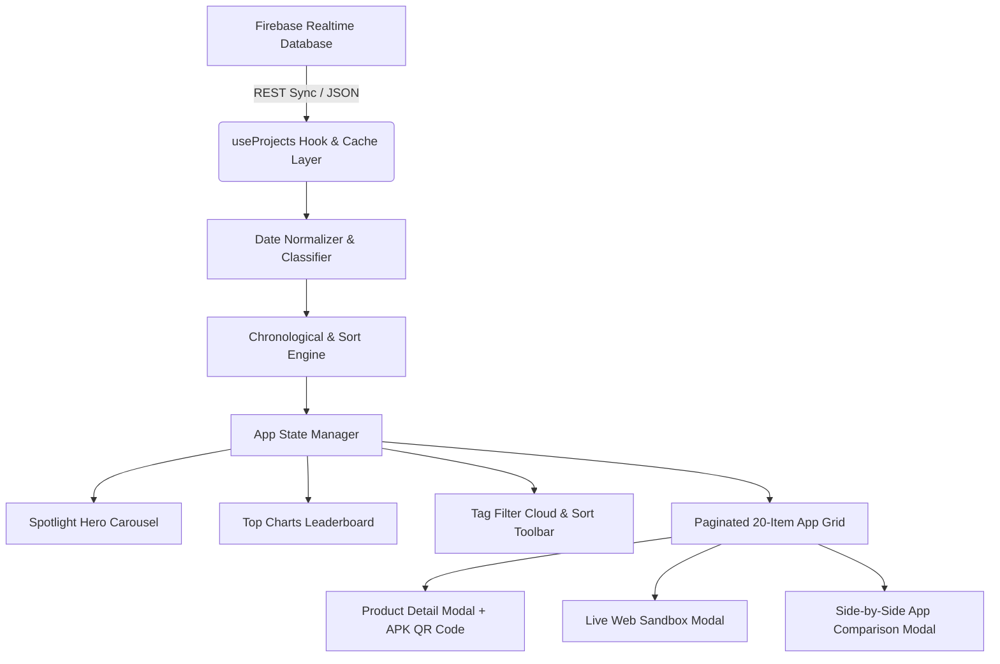
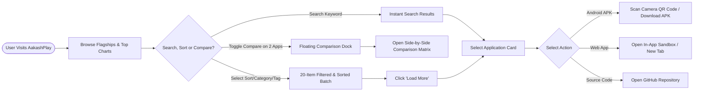

# 🌌 AakashPlay — Official App & Software Store

[](https://react.dev/)
[](https://vitejs.dev/)
[](https://firebase.google.com/)
[](https://AakashPlay.netlify.app)
[](LICENSE)

A modern, high-performance web platform inspired by the **Google Play Store & Apple App Store**, built with **3D Clay UI (Claymorphism)** in a **Cosmic Purple & Neon Violet** aesthetic, powered live by **Google Firebase Realtime Database**.

🔗 **Live Platform:** [https://AakashPlay.netlify.app](https://AakashPlay.netlify.app)

---

## 📑 Table of Contents
1. [🌟 Highlights & Features](#-highlights--features)
2. [📐 System Architecture & Data Flow](#-system-architecture--data-flow)
3. [📊 Project Categories & Stored Applications](#-project-categories--stored-applications)
4. [🛠️ Tech Stack](#️-tech-stack)
5. [🐛 Bug Fixes & Changelog (Dated)](#-bug-fixes--changelog-dated)
6. [📂 Project Structure](#-project-structure)
7. [🚀 Getting Started & Local Setup](#-getting-started--local-setup)
8. [🚢 Deployment & CI/CD Pipeline](#-deployment--cicd-pipeline)
9. [👨‍💻 Author & Contact](#-author--contact)

---

## 🌟 Highlights & Features

- **⚡ Live Firebase Realtime DB Sync**: Real-time polling and instant synchronization of projects from Firebase with local storage cache fallback.
- **📱 Storefront Architecture**: Includes Spotlight Hero Carousel for flagship apps, Top Charts Leaderboard, Category Filters, and Tag Cloud.
- **🎨 Cosmic Purple & Neon Violet 3D Claymorphism**: Dual-layer clay shadows, tactile buttons, vibrant neon violet accents, and smooth theme toggling (Light/Dark).
- **📲 Direct Phone QR Code APK Installer**: Generates instant high-contrast QR codes for direct-to-device APK installations.
- **🌐 Responsive Web Sandbox Preview**: Test live web applications directly within simulated Mobile, Tablet, and Desktop frames, with one-click direct browser tab fallbacks.
- **🔢 Smart 20-Item Batch Pagination**: Clean initial 20-item load with interactive `Load More Apps` pagination and dynamic remainder batching across all screen sizes (mobile, tablet, desktop).
- **🎛️ Advanced Sorting Dropdown**: Instant real-time sorting by *Newest First (Default)*, *Oldest First*, *Alphabetical (A → Z)*, and *Most Tech-Heavy*.
- **⚖️ Side-by-Side App Comparison Mode**: Select up to 2 apps to view an interactive specification matrix, shared vs unique technology deep-dive, platform diff, and direct launch actions via a floating 3D Clay dock.
- **🔒 100% Genuine Metrics**: Zero mock data, simulated star ratings, or fake installs. Only authentic release dates, platforms, and tech stacks.

---

## 📐 System Architecture & Data Flow

### 1. High-Level Architecture


### 2. User Journey & Feature Flow


---

## 📊 Project Categories & Stored Applications

AakashPlay dynamically classifies and displays projects stored in the developer's Firebase Cloud Database:

| Category | Icon | Description | Featured Examples |
| :--- | :---: | :--- | :--- |
| **Native Android** | 📱 | Native mobile apps, background utilities, battery tools, and material UI apps distributed via direct APKs | `StorX`, `Dayflow`, `SavePulse`, `BatteryUtils`, `CleanCraft` |
| **Web SaaS & Tools** | 🌐 | Progressive web apps, cloud dashboards, developer utilities, and AI-assisted web apps | `JSON Lens`, `ResumeCraft`, `MovieGather`, `CareerHighlights` |
| **Open-Source Libraries**| 📦 | Reusable SDKs, packages, developer toolkits, and utility libraries | Custom Android modules, React components, NPM packages |
| **Academic & Research** | 🎓 | Research projects, algorithms, academic publications, and university courseware | Deep learning models, analytical benchmarks |

---

## 🛠️ Tech Stack

- **Frontend Core**: [React 19](https://react.dev/) + [Vite 8](https://vitejs.dev/)
- **Styling & Design System**: Pure Vanilla CSS with Custom 3D Claymorphism tokens (`var(--clay-shadow)`), glassmorphism, and neon gradients
- **Icons & Graphics**: [Lucide React](https://lucide.dev/) + Custom Geometric Monogram SVG
- **Database**: [Google Firebase Realtime Database](https://firebase.google.com/)
- **QR Code Engine**: `qrcode.react` (SVG & Canvas rendering)
- **CI/CD & Hosting**: [GitHub Actions](https://github.com/features/actions) ➔ [Netlify Edge](https://www.netlify.com/)

---

## 🐛 Bug Fixes & Changelog (Dated)

### 📅 October 6, 2026

#### ✨ Added Features & Enhancements
- **Side-by-Side App Comparison Matrix**:
  - Added a "Compare" toggle chip on every app card with active highlighting.
  - Built a floating 3D Clay comparison dock showing selected apps with a `Compare Now (2/2)` launch trigger.
  - Created `<AppComparisonModal>` displaying a full side-by-side specification matrix, shared vs unique technology deep-dive, platform diff, timeline, and direct download/sandbox actions.
- **Advanced Sorting Dropdown**:
  - Integrated real-time sorting toolbar:
    - 🕒 **Newest First** *(Default)*
    - ⏳ **Oldest First**
    - 🔤 **Name (A → Z)**
    - 🛠️ **Most Tech-Heavy** (ranked by stack size)
- **Universal 20-Item "Load More" Pagination**:
  - Implemented an initial 20-card render across all screen sizes (mobile, tablet, and desktop).
  - Added an interactive `Load More Apps` button with dynamic remainder counting (e.g. `Load Remaining 16 Apps`).
  - Seamlessly resets on category or tag filter switches, and displays full matching results automatically during keyword searches.
- **Dynamic Multi-Format Date Parser**:
  - Engineered a regex-based chronological parser in `useProjects.js` capable of sorting mixed date strings (ordinal dates, month-year, year-only integers, ISO-8601).
- **Interactive Multi-Device Web Sandbox**:
  - Integrated in-app responsive viewport preview for live web apps with switchable frames (Mobile, Tablet, Desktop) + top-bar `Open in New Tab ↗` fallback.
- **Camera-Scannable Mobile QR Code Installer**:
  - Added direct QR code generation within project detail modals for rapid on-device Android APK testing.
- **Consolidated `.env` Environment Config**:
  - Unified environment variables into a single production-ready `.env` structure.

#### 🛠️ Bug Fixes & Optimizations
- **Fixed Web Sandbox Layout & Blockers**:
  - Removed intrusive floating bottom overlay blobs inside sandbox iframes that blocked user interactions.
- **Fixed Extreme 3D Card Hover Distortion**:
  - Replaced erratic mouse-following 3D card tilt skews with stable, flat-grounded vertical clay elevation (`translateY(-5px)`).
- **Eliminated Fake/Simulated Data**:
  - Stripped all hardcoded star ratings and mock download counters. Every metric is now 100% authentic to the Firebase DB.
- **Added Netlify SPA Routing Fallback**:
  - Created `public/_redirects` rule (`/* /index.html 200`) to prevent 404 errors during deep linking and page refreshes.

---

## 📂 Project Structure

```text
aakashplay/
├── .github/
│   └── workflows/
│       └── deploy.yml              # Automated Netlify CI/CD Workflow
├── public/
│   ├── _redirects                  # Netlify SPA redirect rules
│   └── favicon.svg                 # Custom Geometric A+Play vector icon
├── src/
│   ├── components/
│   │   ├── AppCard.jsx             # 3D Clay application card
│   │   ├── CategoryNav.jsx         # Store category tab bar
│   │   ├── Footer.jsx              # Credits and developer links
│   │   ├── Header.jsx              # Search, live sync status, theme toggle
│   │   ├── HeroCarousel.jsx        # Flagship app spotlight carousel
│   │   ├── Icons.jsx               # Custom SVG vector monograms
│   │   ├── LiveWebPreviewModal.jsx # Multi-device responsive sandbox
│   │   ├── ProductDetailModal.jsx  # Detailed overview, specs & APK QR Code
│   │   └── TopChartsSection.jsx    # Leaderboard & trending tools
│   ├── hooks/
│   │   └── useProjects.js          # Firebase sync, caching, & date sorting
│   ├── App.jsx                     # Main catalog layout & pagination
│   ├── index.css                   # Cosmic Purple Claymorphic design system
│   └── main.jsx                    # Application root mount
├── .env                            # Environment variables
├── package.json                    # Project metadata & dependencies
├── vite.config.js                  # Vite configuration
└── README.md                       # Documentation & Project Guide
```

---

## 🚀 Getting Started & Local Setup

### Prerequisites
- Node.js (v18.0.0 or higher)
- npm or yarn

### Installation
```bash
# 1. Clone the repository
git clone https://github.com/aakashsakhalkar/AakashPlay.git
cd AakashPlay

# 2. Install dependencies
npm install

# 3. Configure environment variables in .env
# VITE_FIREBASE_DB_URL=https://personalsharingapp.firebaseio.com/CareerHighlights/projects.json
# VITE_DEVELOPER_PORTFOLIO=https://aakash-sakhalkar.web.app/

# 4. Run local development server
npm run dev
```

The application will launch at `http://localhost:5173`.

---

## 🚢 Deployment & CI/CD Pipeline

AakashPlay is continuously deployed to **Netlify** via **GitHub Actions**.

Whenever changes are pushed to `main`, the workflow:
1. Checks out the code and sets up Node.js.
2. Injects build secrets (`VITE_FIREBASE_DB_URL`).
3. Executes production build (`npm run build`).
4. Deploys the generated `dist/` bundle to Netlify Edge.

### Repository Secrets Required:
- `NETLIFY_AUTH_TOKEN`
- `NETLIFY_SITE_ID`
- `VITE_FIREBASE_DB_URL`

---

## 👨‍💻 Author & Contact

Crafted with ❤️ by **[Aakash Sakhalkar](https://aakash-sakhalkar.web.app/)**

- **Portfolio**: [https://aakash-sakhalkar.web.app/](https://aakash-sakhalkar.web.app/)
- **GitHub**: [@aakashsakhalkar](https://github.com/aakashsakhalkar)
- **Store Platform**: [AakashPlay on Netlify](https://AakashPlay.netlify.app)
